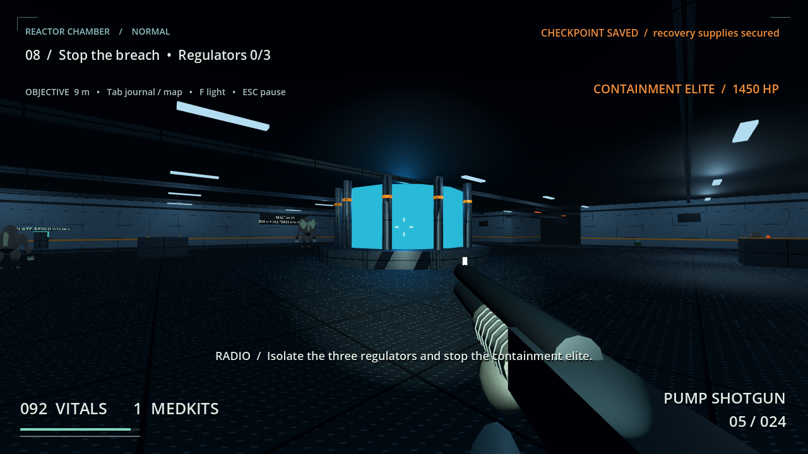

# BLACKOUT: SECTOR 13

**Created by Amir Saeid Dehghan**

A native, offline, single-player first-person horror action game for Windows x64. Respond to a distress signal in an abandoned underground research facility, restore power, survive containment failure, stop the reactor breach and escape.

**Version 1.0.0 — actual Windows installer, portable game and complete source included.** Players do not need Godot, Python, Node.js or development tools.

*Real screenshot from the exported Linux QA build with the same PCK as the Windows export. This is a staged QA scene, not a Windows gameplay capture.*

## Downloads

| File | Size | Purpose |
|---|---:|---|
| [Windows installer](https://github.com/saaeiddev/BLACKOUT-SECTOR-13/raw/refs/heads/main/downloads/1.0.0/BlackoutSector13-Setup-1.0.0.exe) | 25,291,013 bytes | Per-user NSIS installer |
| [Portable Windows x64 ZIP](https://github.com/saaeiddev/BLACKOUT-SECTOR-13/raw/refs/heads/main/downloads/1.0.0/BlackoutSector13-Windows-x64-Portable-1.0.0.zip) | 34,916,332 bytes | Extract and open BlackoutSector13.exe |
| [Original source ZIP](downloads/1.0.0/BlackoutSector13-Source-1.0.0.zip) | 2,792,147 bytes | Complete 1.0.0 source snapshot |
| [QA evidence ZIP](downloads/1.0.0/BlackoutSector13-QA-Evidence-1.0.0.zip) | 3,979,390 bytes | Reports, logs, results and real screenshots |

[SHA-256 checksums](downloads/1.0.0/SHA256SUMS.txt) · [Exact sizes and release metadata](downloads/1.0.0/Release-Manifest.json)

## Install and launch

Run `BlackoutSector13-Setup-1.0.0.exe`, then launch from the Start menu. The installer offers an optional desktop shortcut and launch-after-install. Installation is per user; uninstall code preserves saved games.

For the portable version, extract the **entire ZIP** and open `BlackoutSector13.exe`. Keep `BlackoutSector13.pck` beside it. All game assets are local. No editor, terminal, compiler or extra programming runtime is required to play.

The binaries are **unsigned**. Actual Windows 11 installation, gameplay and uninstall have **not been tested** in the available environment. Read the [full QA report](game/docs/QA-Report.md); this is not a fully validated Windows release.

### راهنمای فارسی

فایل **Windows installer** را دانلود و اجرا کنید؛ سپس بازی را از منوی Start باز کنید. برای اجرای بدون نصب، فایل **Portable Windows x64 ZIP** را کامل استخراج کنید و `BlackoutSector13.exe` را باز کنید. فایل `BlackoutSector13.pck` باید کنار آن بماند. موتور بازی یا ابزار برنامه‌نویسی لازم نیست.

ذخیرهٔ بازی در نقاط کلیدی مأموریت خودکار است. Continue آخرین ذخیره را باز می‌کند. محل ذخیره‌ها و تنظیمات در ویندوز: `%APPDATA%\BlackoutSector13`. راهنمای کامل فارسی داخل هر دو بسته است و در [Player-Guide-FA.html](game/docs/Player-Guide-FA.html) نیز قرار دارد؛ برای مشاهدهٔ قالب‌بندی، فایل را دانلود و باز کنید.

## Campaign and features

- Connected security entrance, maintenance corridors, switchgear, substation, generator, laboratory, containment area, reactor and evacuation route.
- Arrival and tutorial → pistol and flashlight → auxiliary power → security keycard → laboratory → shotgun → containment waves → reactor regulators and elite fight → evacuation → ending credits.
- Pistol and pump-action shotgun, aiming, reloads, ammunition, flashlight, sprint, crouch, jump and medkits.
- Stalker and ambusher creatures, a final containment elite, telegraphed attacks and navigation.
- Normal/Easy difficulty, mission journal, facility map, six optional field records, checkpoints and continue/restart.
- Sensitivity, inverted Y, FOV, brightness, key rebinding, subtitles, head bob and camera-shake settings; motion blur is never applied.
- Low/Medium/High quality, resolutions, fullscreen/windowed mode, VSync, FPS cap and separate master/music/effects volumes.
- Original procedural models, animated creature rigs, textures and synthesized sound design. Narrative uses radio text; no recorded voice acting.

## Controls

| Action | Input |
|---|---|
| Move / look | W A S D / mouse |
| Sprint / crouch / jump | Shift / Ctrl / Space |
| Fire / aim | Left mouse / right mouse |
| Reload / flashlight / interact | R / F / E |
| Pistol / shotgun / medkit | 1 / 2 / Q |
| Journal and map / pause | Tab / Esc |

## Validation and limitations

The delivered build passed **31 automated checks on Linux**: 26 graphical smoke checks, 3 save/load checks in a new exported process, and complete campaigns in both Normal and Easy. Environment: Ubuntu 24.04.3 LTS, Xvfb at 1280×720, Mesa llvmpipe software rendering, Dummy audio. The exported Linux runtime used a byte-identical Windows PCK.

NSIS payload extraction, portable ZIP integrity, AMD64 PE architecture and release hashes were verified. Screenshots are genuine exported-game frames; some use explicitly staged mission states. The separate campaign bot uses normal movement, collisions, interactions, shooting, reloading and healing.

Still unverified: Windows 11 install/launch/shortcuts/uninstall/reinstall, physical Windows Alt-Tab, audible output, full manual campaign playthrough, RTX 4060 laptop 1080p/60 FPS, and first-time human duration. The intended 15–25 minute duration is a target; the optimal bot completes in about 6.5 simulated minutes. The game has a modest low-poly independent visual style; no photorealistic or AAA claim is made.

- [Detailed PASS / FAIL / NOT TESTED report](game/docs/QA-Report.md)
- [Browsable logs and screenshots](docs/qa/)
- [Package verification](docs/qa/Package-Verification.json)
- [GitHub upload integrity check](docs/qa/GitHub-Upload-Verification.json)

## Source and building

| Path | Contents |
|---|---|
| `game/` | Complete editable Godot project |
| `game/scripts/` | Gameplay, creatures, world, UI, persistence and QA |
| `game/assets/` | Original audio, textures and icons |
| `game/build/` | Asset generation, tool setup, NSIS, metadata, QA and packaging scripts |
| `game/docs/` | Persian guide, QA report and third-party notices |
| `downloads/1.0.0/` | Installer, portable game, source/evidence archives and checksums |
| `docs/qa/` | Unedited screenshots, raw logs and check results |

Pinned stack: **Godot 4.5.1.stable.official.f62fdbde1**, matching Windows x64 release templates, GDScript/Compatibility renderer, **NSIS 3.09**, LIEF 1.0.0 and pefile 2024.8.26. Open `game/project.godot` for development. See [complete build instructions](game/README.md) for optional rebuilding and QA. Players should use the downloads above.

The installer and portable ZIP are the unchanged delivered 1.0.0 files. Upload automation checks their original SHA-256 hashes; it does not rebuild or execute Windows binaries. Editor caches, downloaded engine toolchains and personal save profiles are excluded. If the game is modified, rerun tests and update the report and checksums.

## Credits and licenses

**Created by Amir Saeid Dehghan.** AI-assisted development and technical production.

Original project-specific files may be used, modified and redistributed by Amir Saeid Dehghan. No additional open-source license is granted here. Godot, NSIS and their components retain their respective licenses: [THIRD-PARTY-NOTICES.txt](game/docs/THIRD-PARTY-NOTICES.txt).
